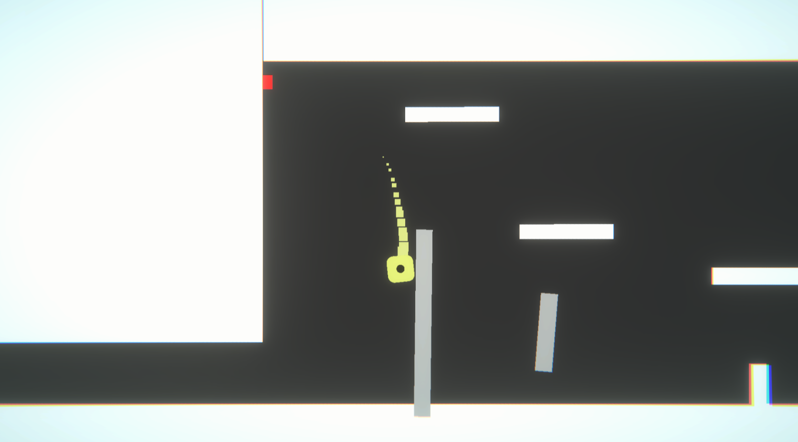
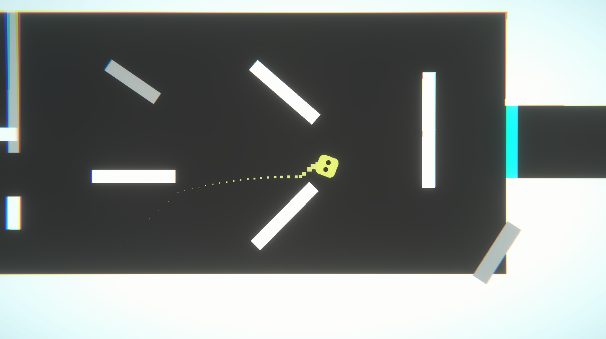

# Die : A Slingshot Movement Mechanism Platformer Game Prototype

This repository contains a prototype for a platformer game called Die, based on a slingshot movement mechanism. It is developed using Unity and the movement is based on mouse input. The dice is rolled directly when you move it, and when it stops moving, its velocity gets to zero. It serves as a base point or template for game developers who want to create their own version of the game.

**Gameplay:**

- The player uses the mouse to control the slingshot mechanism and move the character across the platforms.
- The twist in the game is that when the player rolls the die, the number that appears determines the number of platforms that disappear.
- The disappearing platforms are randomly chosen based on the number rolled on the die.
- For example, if there are 20 platforms and the number rolled on the die is 4, then 4 platforms will randomly disappear, leaving 16 platforms.

**ScreenShots:**

**Installation:**

- Clone this repository to your local machine using git clone https://github.com/00siddhant00/Die.git
- Open the project in Unity.
- Open the SampleScene scene in the Scenes folder to play the game.

**Usage:**

- Use the mouse to control the slingshot mechanism and move the character in the respective direction.
- Roll the die by moving it, and when it stops moving, its velocity gets to zero.
- The number that appears on the die determines the number of platforms that will disappear.
- Reach the end of the level by navigating through the disappearing platforms.

**Contributing:**

Contributions are always welcome!
Fork the repository and create a new branch with your changes.
Submit a pull request for review and approval.

**Credits:**

Developed by [Sid](https://www.instagram.com/00_siddhant_00/).
Secondry code and logic help [Dev Patil](https://www.instagram.com/dev0910/).
Level Design by [Harsh Kanaskar](https://www.instagram.com/harshkanaskar/).

**License:**

This project is licensed under the MIT license. See the LICENSE.md file for details.
